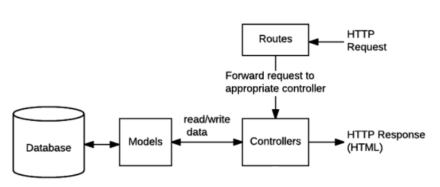
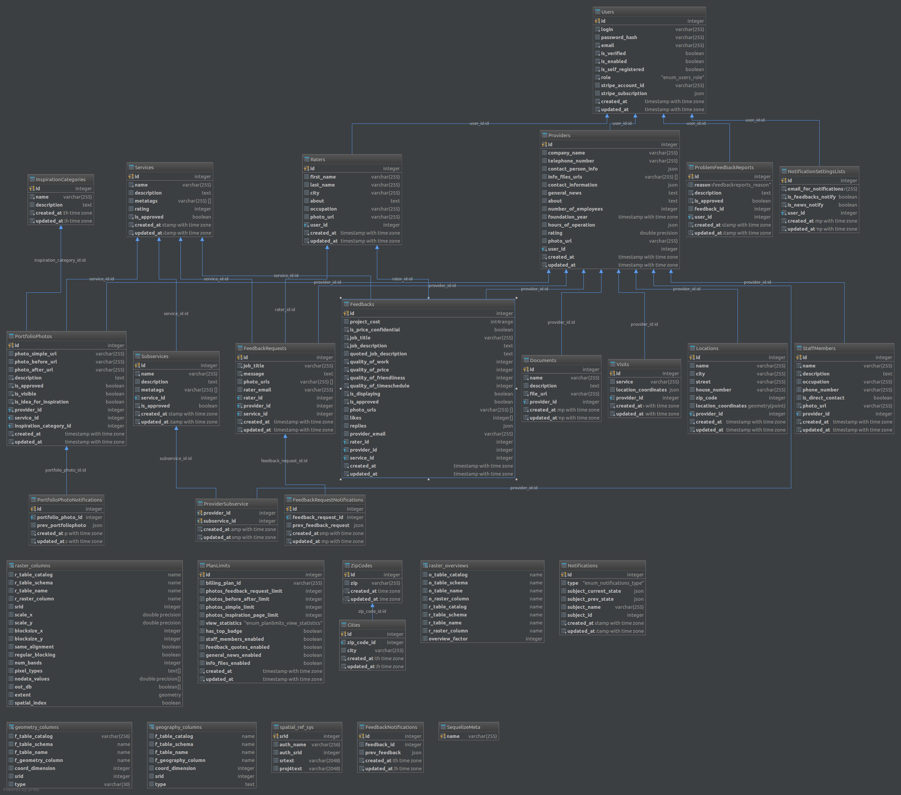

# okornok project

## NPM commands

    $ npm start - start the server
    $ npm run start:dev - run server in dev mode
    $ npm test - run tests
    $ npm run deploy - deploy to remote
    $ npm run migrate - run db migrations to last version and seed db
    $ npm run docs:server - generate jsdoc docs for server
    $ npm run git-hook - copy hook file to git folder
    
## Deploy to Heroku
   * need login to heroku
        
    $ heroku login
    
   * if needed, connect to repository
   
    $ heroku git:remote -a okornok
    
   * run deploy script
   
    $ npm run deploy
    
## Deploy on docker hub

    # first, you ned to log in
    $ docker login
    # you will be promted for the credentials
    # build docker from curret dir, please be in /okornok                
    $ docker build --tag okornok/okornok-node-dev .
    # optional: run docker container locally
    $ docker run --rm --publish-all --name okornok-node-dev okornok-node-dev:latest
    # optionsl: list all docker images in your system
    $ docker images --all
    # publish to Docker hub
    $ docker push okornok/okornok-node-dev
    
### Deploy to EC2

For deploy from private repo on docker hub to ec2 follow [https://docs.aws.amazon.com/elasticbeanstalk/latest/dg/create_deploy_docker_image.html#create_deploy_docker_image_dockerrun](https://docs.aws.amazon.com/elasticbeanstalk/latest/dg/create_deploy_docker_image.html#create_deploy_docker_image_dockerrun)

##### initialization

    # create on S3 private bucket "okornok-docker-deploy"
    # log in to docker to get auth file
    $ docker login
    # copy latest docker auth file to project 
    $ cp ~/.docker/config.json ./.config/docker-hub-auth.json
    # upload the authentication file to a secure Amazon S3 bucket "okornok-docker-deploy"
    # follow: 

[http://docs.aws.amazon.com/elasticbeanstalk/latest/dg/docker-singlecontainer-deploy.html](http://docs.aws.amazon.com/elasticbeanstalk/latest/dg/docker-singlecontainer-deploy.html)          

## Folder structure
  * bin - scripts
  * .config - config for tools like jstoc etc
  * config - config files with credentials, urls etc
      * database
          * enums - db fields enums definitions
  * specs - test sources
  * utils - util functions, for example - db connection, app initialization
      * database
          * migrations
          * seeders
      * initialization
  * models - sequelize models
  * controllers - controllers
  * services - service layer for db interactions
  * routes - routes
  * views - should be omitted
  * public - static content  

## API
* [x] /auth - authorization
    * [x] /sign-up - registration
        * [x] /rater - register rater POST
        * [x] /provider - register provider POST
    * [x] /sign-in - login as user, no matter rater or provider POST
* [x] /api
    * [x] /v1 - 1 version of api
        * [x] /users - array of users GET, if geted email in query then get array with one user
            * [x] /:id - concrete user by id GET, PUT, DELETE - only supporter
                * [x] /billing
                    * [x] /card-form - GET credit card input page (JWT required) 
                    
                            curl -XGET 'http://okornok.herokuapp.com/api/v1/billing/card-form?jwtToken=eyJ0eXAiOiJKV1QiLCJhbGciOiJIUzI1NiJ9.eyJpZCI6Mn0.aUb_nRvvc16eD6ZVrHJWVhi0GwjeZpdAIKtHIQa8IpI'
                    
                    * [x] /stripe-publishable-key - GET get stripe publishable key.
                           
                * [x] /rater - concrete user's rater info. Allows GET, PUT.
                    * [x] /feedbacks - concrete user's feedbacks. Allows GET query with limit and offset (token needed), POST.
                        * [x] /:feedback_id - concrete feedback by id. Allows GET, PUT, DELETE.
                    * [x] /feedback-requests Allows GET, query with limit and offset. 
                        * [x] /:feedback_request_id - concrete feedback-request by id. Allows GET, PUT, DELETE. 
                    * [x] /notifications - GET rater notifications
                * [x] /provider - concrete user's provider info. Allows GET, PUT.
                    * [x] /feedbacks - concrete user's feedbacks. Allows GET query with limit and from (token needed).
                        * [x] /:feedback_id - concrete feedback by id. Allows GET, PUT - updating only fields (quoted_job_description, is_displaying, replies, likes).
                    * [x] /feedback-requests Allows GET query with limit and offset, POST. 
                        * [x] /:feedback_request_id - concrete feedback-request by id. Allows GET, PUT, DELETE. 
                    * [x] /portfolio-photos Allows GET query with limit and offset (token needed), POST.
                        * [x] /:portfolio_photo_id - concrete portfolio-photo by id. Allows GET, PUT, DELETE.
                    * [x] /documents Allows GET, query with limit and offset, POST.
                        * [x] /:document_id - concrete document by id. GET will cause file download. Allows GET, PUT, DELETE.
                    * [x] /subservices - Allows GET - all providers subservices with services, POST - set sub-services to provider
                    * [x] /staff-members - Allows GET - all provider staff-members, POST - create staff-member for provider.
                        * [x] /:staff_id - GET - concrete staff-member by id. Allows GET, PUT, DELETE.
                                
                                curl -XGET 'http://okornok.herokuapp.com/api/v1/users/2/provider/staff-members?jwtToken=eyJ0eXAiOiJKV1QiLCJhbGciOiJIUzI1NiJ9.eyJpZCI6Mn0.aUb_nRvvc16eD6ZVrHJWVhi0GwjeZpdAIKtHIQa8IpI'
                                
                    * [x] /locations - GET - get locations belonged to concrete provider, POST - create location to concrete provider.
                        * [x] /:location_id - GET - get concrete location, PUT - update concrete location, DELETE - remove concrete location.
                    * [x] /visits - GET - get this provider visits
                    * [x] /notifications - GET provider notifications
                    * [x] /request-feedback-by-email - POST send request feedback by email.
                
                * [x] /notification-settings-list - concrete user's notification settings info. Allows GET, PUT.
                * [x] /problem-feedback-reports - concrete user's problem feedback reports. Allows GET, POST.
                    * [x] /:problem_feedback_report_id - concrete user's concrete problem feedback report. Allows GET, PUT, DELETE.
                * [x] /request-email-confirmation - GET, sending email to user for confirm the email.
                * [x] /confirm-email - GET, confirm email by the concrete user's by the link.
                * [x] /forgot-password - GET, sending email to user for run update of the password.
                * [x] /subscription - PUT { plan_id: plan_id }, update subscription to appropriate stripe plan id
                * [x] /plan-limit - GET plan limit info
                * [x] /billing-card - GET get confirmation of availability credit cards, POST submit form to set stripe user source (credit card) { jwtToken, stripeToken }, DELETE - delete all credit cards
                    
                        curl -XPOST -H "Content-type: application/json" -d '{"jwtToken": "eyJ0eXAiOiJKV1QiLCJhbGciOiJIUzI1NiJ9.eyJpZCI6Mn0.aUb_nRvvc16eD6ZVrHJWVhi0GwjeZpdAIKtHIQa8IpI", "stripeToken": "tok_1AW7FuHyBx8Sh2uZkU4Zv3qg"}' 'http://localhost:3000/api/v1/users/2/billing-card'
                        curl -XDELETE -H 'Authorization: JWT eyJ0eXAiOiJKV1QiLCJhbGciOiJIUzI1NiJ9.eyJpZCI6Mn0.aUb_nRvvc16eD6ZVrHJWVhi0GwjeZpdAIKtHIQa8IpI' 'http://localhost:3000/api/v1/users/2/billing-card'
                * [x] /email - PUT { email: newEmail }, update email in user and in stripe account.
                    
        * [x] /feedbacks - all feedbacks GET
            * [x] /:feedback_id - concrete feedback GET, PUT, DELETE
        * [x] /feedback-requests - all feedback requests GET
            * [x] /:feedback_request_id - concrete feedback request GET, PUT, DELETE
        * [x] /services - all services GET (limit, offset) with sub-services and POST
            * [x] /:service_id - concrete service GET, PUT, DELETE
        * [x] /sub-services - all sub-services GET
            * [x] /:sub_service_id - concrete service GET, PUT, DELETE
        * [x] /problem-feedback-reports - problem feedback reports. Allows GET with offset, limit.
            * [x] /:problem_feedback_report_id - concrete problem feedback report. Allows GET, DELETE.
        * [x] /providers - get all providers with all included, allowed next options of sorting: offset, limit, subserviceName, serviceName, lng, lat, distance, minRating, maxRating, isSortByRatingOnly, searchText, city.
            * [x] /:provider_id - GET - get all information about provider (include user model)
        * [x] /raters - get all raters with all included, allow limit and offset
            * [x] /:rater_id - GET - get all information about rater (include user model)
        * [x] /billing
            * [x] /plans - GET all billing plans
        * [x] /uploads
            * [x] /images - POST image, returns link to saved image
            * [x] /files - POST file, returns link to saved file
        * [x] /contact-us - POST sending mail to support
        * [x] /inspiration-photos - GET - get all portfolio photo for inspiration (allowed offset and limit).
            * [x] /:inspiration_category_id - GET - get portfolio photos by inspiration category id (allowed offset and limit).
        * [x] /inspiration-categories - GET - get all inspiration categories, POST - create inspiration category.
            * [x] /:category_id - GET - get concrete inspiration category, PUT, DELETE.
        * [x] /notifications
            * [x] /feedback-notifications
            * [x] /feedback-request-notifications
            * [x] /portfolio-photo-notifications
        * [x] /zip-codes - GET all zip codes with query params: offset, limit, zipPart, cityPart
            
                curl -XGET 'http://okornok.herokuapp.com/api/v1/zip-codes?zipPart=89&cityPart=ae'
            
        * [x] /cities - GET all zip codes with query params: offset, limit, zipPart, cityPart
                    
                curl -XGET 'http://okornok.herokuapp.com/api/v1/cities?zipPart=89&cityPart=ae'
        * [x] /stripe-notifications - GET get all notifications, POST - create new notification.
            * [x] /:stripe_notification_id - GET get concrete notification, PUT - update concrete notification, DELETE remove notification.
            
## Additional info
### databases
#### postgres
See actual credentials: [https://data.heroku.com/datastore/1c53b79f-0472-4388-8249-699874756637](https://data.heroku.com/datastore/1c53b79f-0472-4388-8249-699874756637)

Database URL should be fetched dynamically further:
    
    DATABASE_URL=$(heroku config:get DATABASE_URL -a your-app) your_process
    
Enabling Postgres GIS on Heroku:
    
    $ heroku pg:psql --app okornok
    $ create extension postgis;

Enabling Postgres GIS on Amazon RDS (common):
[http://docs.aws.amazon.com/AmazonRDS/latest/UserGuide/Appendix.PostgreSQL.CommonDBATasks.html#Appendix.PostgreSQL.CommonDBATasks.PostGIS](http://docs.aws.amazon.com/AmazonRDS/latest/UserGuide/Appendix.PostgreSQL.CommonDBATasks.html#Appendix.PostgreSQL.CommonDBATasks.PostGIS)

    $ psql --host okornok-aws-dev.ct8hhgqkekcg.us-west-2.rds.amazonaws.com --port 5432 --dbname okornok_aws_dev --username okornok
    postgres=> create extension postgis;
    postgres=> create extension fuzzystrmatch;
    postgres=> create extension postgis_tiger_geocoder;
    postgres=> create extension postgis_topology;

#### sequelize ORM
To generate new model, run sequelize model:create. example:

    $ sequelize model:create --name User --attributes login:string,isEnabled:boolean

After it will be defined model and generated migrations file with create-table function.

!WARNING, before manually change something in migrations (utils/database/migrations/), revert database to initial state. Than you can change something in migrations and run them all one more time.

    # revert DB to clear state
    $ sequelize db:migrate:undo:all
    # now you can change migrations manually
    # run all migrations
    $ npm run migrations

#### test DB
1. To run app on test DB you need run server with NODE_ENV=test
2. To run migrations and seeds run npm run migrate:test:db

### mongodb
See current logs: [https://mlab.com/databases/okornok/collections/logs](https://mlab.com/databases/okornok/collections/logs)

Database URL fetched dynamically:

    DB_URL=mongodb://db_user:password@db_host:port/name_of_db

Collection model is generated automatically

### Stripe
In project used Stripe payment system. Each created user has stripe account and subscribed on basic (for providers) or bewerter (for raters) billing plan.
Stripe billing plans must be created in stripe account manually.

## Models
### Statistics
To collect statistics properly you should send HTTP header with user location:
    
    Geolocation: '{"lng":Number,"lat":Number}'

### Plan limits
Field "billing_plan_id" should be same as appropriate stripe plan id. User belongs to PlanLimit through Stripe by: 

    stripe_subscription > items > data > plan > id

## Diagrams
### Architecture diagram:

### DB diagram:

## Additional server info
### Cron jobs info:

Define timezone according to [https://momentjs.com/timezone/](https://momentjs.com/timezone/) in server/config/cron-job.config.json to create cron job pattern see online generator [http://www.cronmaker.com/](http://www.cronmaker.com/)

# Client

This project was generated with [angular-cli](https://github.com/angular/angular-cli) version 1.0.0.

## Development server
Run `ng run serve` for a dev server. Navigate to `http://localhost:4200/`. The app will automatically reload if you change any of the source files.

## Code scaffolding

Run `ng generate component component-name` to generate a new component. You can also use `ng generate directive/pipe/service/class/module`.

## Styles

### Architecture

- Variables/mixins/functions (all of the pieces, that are not converted to css): `client/src/app/styles/base`
 
- Global styles: `client/src/app/styles/common/`
 
- Component styles are stored in the respective component folder
 
### Workflow

- selector `:host` is used to style component root element (e.g. `<app-article></app-article>`)
 
- selector `/deep/` is used to force a style down through the child component tree into all of the child component views
 
- For material component styling additional class is used, that creates context. E.g. `<md-input-container class="your-class-for-the-input"><md-input-container>`. This will compile to: `.your-class-for-the-input .some-material-class-inside {...}`
 
- New shared component should be added to the `client/src/app/shared/shared.module.ts` file in the `exports` field.

## Build

Run `ng build` to build the project. The build artifacts will be stored in the `dist/` directory. Use the `-prod` flag for a production build.

## Running unit tests

Run `ng test` to execute the unit tests via [Karma](https://karma-runner.github.io).

## Running end-to-end tests

Run `ng e2e` to execute the end-to-end tests via [Protractor](http://www.protractortest.org/).
Before running the tests make sure you are serving the app via `ng serve`.

## Deploying to GitHub Pages

Run `ng github-pages:deploy` to deploy to GitHub Pages.

## Further help

To get more help on the `angular-cli` use `ng help` or go check out the [Angular-CLI README](https://github.com/angular/angular-cli/blob/master/README.md).
